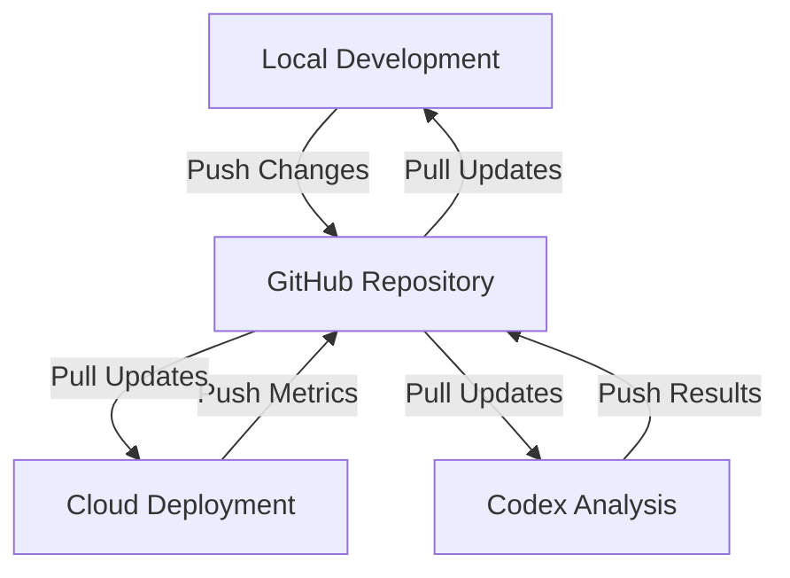

# OpenAI Codex Integration Plan: System-Reference Repository Analysis

## 🎯 **Overview**

This document outlines the complete integration plan for using OpenAI Codex to perform comprehensive analysis of the System-Reference repository while maintaining shared state across local, cloud, and Codex environments.

---

## 📋 **Task Description for OpenAI Codex**

### **Primary Task**
```
Perform a comprehensive analysis of the System-Reference repository located at:
https://github.com/Kausiukas/System-Reference

Working Branch: cloud

Focus on:
1. Code quality assessment and improvement recommendations
2. Architecture review and scalability analysis
3. Security vulnerability detection and mitigation
4. Performance optimization and bottleneck identification
5. Documentation audit and improvement suggestions
6. Deployment readiness assessment for Streamlit Cloud

Use the shared state management system to synchronize analysis results across environments.
```

### **Detailed Instructions for Codex**

#### **1. Repository Analysis**
```markdown
## Step 1: Clone and Setup
- Clone the repository: https://github.com/Kausiukas/System-Reference
- Set up analysis environment with required tools
- Initialize shared state management system

## Step 2: Comprehensive Analysis
- Analyze all Python files in src/ directory
- Review configuration files and documentation
- Assess deployment configuration
- Evaluate automated systems (github_auto_update.py)

## Step 3: Generate Recommendations
- Create prioritized improvement list
- Generate automated fixes where possible
- Update documentation and guides
- Provide implementation roadmap
```

#### **2. Shared State Integration**
```python
# Use the shared state management system:
from src.utils.shared_state_manager import SharedStateManager

# Initialize manager
manager = SharedStateManager()

# Update analysis results
manager.update_state(
    analysis_type="code_quality",
    score=85.0,
    metrics={"files_analyzed": 25, "issues_found": 12},
    issues=[{"priority": "high", "description": "Complex function detected"}],
    recommendations=[{"priority": "medium", "action": "Refactor complex functions"}]
)

# Push results to repository
manager.push_to_remote("Codex analysis: Code quality assessment")
```

---

## 🔄 **Shared State Management Workflow**

### **Environment Integration**

#### **Local Development Environment**
```python
# Local developers can:
1. Pull latest analysis results
2. View recommendations and issues
3. Apply automated fixes
4. Update local state and push changes
```

#### **Cloud Deployment Environment**
```python
# Streamlit Cloud can:
1. Monitor real-time performance metrics
2. Collect user feedback and errors
3. Update shared state with production data
4. Trigger analysis based on performance thresholds
```

#### **Codex Analysis Environment**
```python
# Codex can:
1. Perform deep code analysis
2. Generate comprehensive reports
3. Create automated fixes
4. Update shared state with analysis results
```

### **State Synchronization Process**



---

## 📊 **Analysis Categories and Metrics**

### **1. Code Quality Analysis**
```yaml
Metrics to Collect:
  - Cyclomatic complexity
  - Maintainability index
  - Code duplication percentage
  - Test coverage
  - Documentation coverage
  - Code style compliance

Tools to Use:
  - pylint
  - flake8
  - mypy
  - radon
  - coverage.py
```

### **2. Architecture Review**
```yaml
Areas to Analyze:
  - Component coupling and cohesion
  - Dependency relationships
  - Scalability patterns
  - Error handling strategies
  - State management approaches

Output:
  - Architecture diagram
  - Dependency graph
  - Scalability assessment
  - Improvement recommendations
```

### **3. Security Analysis**
```yaml
Security Checks:
  - API key exposure
  - Input validation
  - Error information disclosure
  - Dependency vulnerabilities
  - Authentication mechanisms

Tools:
  - bandit
  - safety
  - semgrep
  - manual code review
```

### **4. Performance Optimization**
```yaml
Performance Metrics:
  - Response time analysis
  - Memory usage patterns
  - CPU utilization
  - Database query optimization
  - Caching effectiveness

Profiling Tools:
  - cProfile
  - memory_profiler
  - line_profiler
  - database query analyzer
```

### **5. Documentation Audit**
```yaml
Documentation Assessment:
  - README completeness
  - API documentation accuracy
  - Deployment guide clarity
  - Code documentation coverage
  - Troubleshooting guide usefulness
```

---

## 🚀 **Implementation Strategy**

### **Phase 1: Setup and Initial Analysis**
```bash
# 1. Clone repository
git clone https://github.com/Kausiukas/System-Reference.git
cd System-Reference

# 2. Set up analysis environment
pip install -r requirements.txt
pip install pylint flake8 mypy radon bandit safety

# 3. Initialize shared state
python -c "
from src.utils.shared_state_manager import SharedStateManager
manager = SharedStateManager()
manager.update_state('setup', 100, {'status': 'ready'})
"

# 4. Run initial analysis
python scripts/codex_analysis.py
```

### **Phase 2: Comprehensive Analysis**
```python
# Run analysis for each category
analysis_categories = [
    'code_quality',
    'architecture', 
    'security',
    'performance',
    'documentation'
]

for category in analysis_categories:
    results = run_analysis(category)
    manager.update_state(category, results['score'], results['metrics'])
    manager.push_to_remote(f"Codex analysis: {category}")
```

### **Phase 3: Recommendations and Fixes**
```python
# Generate and apply recommendations
recommendations = generate_recommendations()
automated_fixes = generate_automated_fixes()

# Update state with recommendations
manager.update_state(
    'recommendations',
    90.0,
    {'recommendations_count': len(recommendations)},
    recommendations=recommendations,
    automated_fixes=automated_fixes
)

# Apply automated fixes
apply_automated_fixes(automated_fixes)
```

---

## 📈 **Expected Outcomes**

### **Immediate Benefits**
- **Issue Identification**: Clear understanding of current system state
- **Performance Improvement**: Identified bottlenecks and optimization opportunities
- **Security Enhancement**: Vulnerability detection and mitigation
- **Code Quality**: Improved maintainability and readability

### **Long-term Benefits**
- **Scalability**: Better architecture for future growth
- **Maintainability**: Easier code maintenance and updates
- **Reliability**: Reduced bugs and improved stability
- **Developer Experience**: Better tools and documentation

### **Shared State Benefits**
- **Real-time Synchronization**: All environments stay updated
- **Automated Improvements**: Continuous analysis and optimization
- **Collaborative Development**: Better coordination between teams
- **Quality Assurance**: Automated quality checks and validations

---

## 🔧 **Technical Implementation**

### **Required Tools and Dependencies**
```yaml
Analysis Tools:
  - pylint: Code quality analysis
  - flake8: Style guide enforcement
  - mypy: Type checking
  - radon: Complexity analysis
  - bandit: Security analysis
  - safety: Dependency vulnerability scanning
  - cProfile: Performance profiling
  - memory_profiler: Memory usage analysis

Python Packages:
  - gitpython: Git repository interaction
  - pyyaml: Configuration file handling
  - requests: HTTP requests for API calls
  - dataclasses: Data structure management
```

### **Configuration Files**
```yaml
Required Configuration:
  - config/shared_state_config.yaml: Shared state configuration
  - config/github_update_config_clean.yaml: GitHub update configuration
  - .streamlit/config.toml: Streamlit configuration
  - requirements.txt: Python dependencies
```

### **Integration Points**
```python
# Key integration points:
1. GitHub repository as central state hub
2. Automated update system for synchronization
3. Streamlit Cloud for deployment monitoring
4. Local development environment for testing
5. Codex analysis environment for deep analysis
```

---

## 📝 **Usage Instructions**

### **For OpenAI Codex**
1. **Read the task description** in `codex_analysis_task.md`
2. **Clone the repository** and set up analysis environment
3. **Initialize shared state management** system
4. **Run comprehensive analysis** for all categories
5. **Generate recommendations** and automated fixes
6. **Update shared state** with analysis results
7. **Push results** to GitHub repository

### **For Local Developers**
1. **Pull latest analysis** from shared state
2. **Review recommendations** and priority issues
3. **Apply automated fixes** where appropriate
4. **Update local state** with improvements
5. **Push changes** to repository

### **For Cloud Deployment**
1. **Monitor performance metrics** in real-time
2. **Collect user feedback** and error reports
3. **Update shared state** with production data
4. **Trigger analysis** based on performance thresholds
5. **Apply improvements** automatically when safe

---

## 🔄 **Continuous Improvement**

### **Automated Analysis Pipeline**
```yaml
Triggers:
  - Code commits and pull requests
  - Performance threshold breaches
  - Security vulnerability detection
  - Scheduled analysis runs
  - User feedback collection

Actions:
  - Run targeted analysis
  - Update shared state
  - Generate recommendations
  - Apply automated fixes
  - Notify stakeholders
```

### **Feedback Loop**
```python
# Continuous improvement cycle:
1. Analysis → 2. Recommendations → 3. Implementation → 4. Validation → 5. Feedback → 1. Analysis
```

---

## 📊 **Success Metrics**

### **Quantitative Metrics**
- **Code Quality Score**: Maintainability index improvement
- **Performance Metrics**: Response time and throughput improvements
- **Security Score**: Vulnerability reduction percentage
- **Documentation Coverage**: Completeness and accuracy scores
- **Test Coverage**: Automated test coverage improvement

### **Qualitative Metrics**
- **Developer Experience**: Code maintainability and readability
- **User Experience**: Application responsiveness and reliability
- **Deployment Success**: Reduced deployment issues and rollbacks
- **Team Productivity**: Faster development and debugging cycles

---

## 🎯 **Next Steps**

1. **Review the task description** in `codex_analysis_task.md`
2. **Set up the shared state management** system
3. **Configure analysis tools** and dependencies
4. **Run initial analysis** to establish baseline
5. **Implement recommendations** and improvements
6. **Set up continuous monitoring** and analysis
7. **Document lessons learned** and best practices

This integration plan provides a comprehensive framework for using OpenAI Codex to analyze and improve the System-Reference repository while maintaining synchronized state across all environments. 