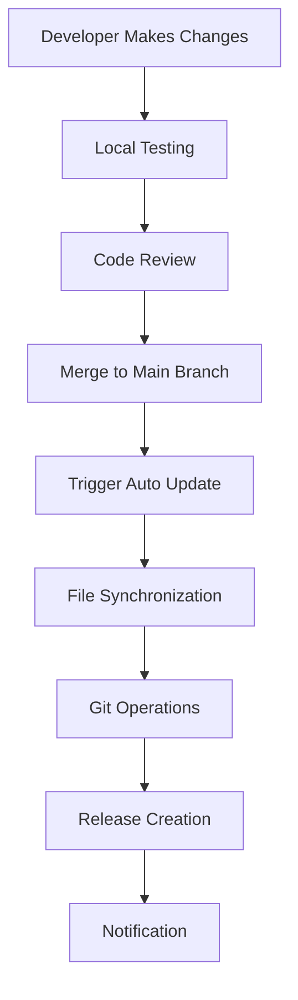

# Automated GitHub Repository Update System

## 🎯 **Overview**

The Automated GitHub Repository Update System is a comprehensive solution for keeping the System-Reference repository synchronized with the latest code, documentation, and configuration files. It provides automated version control, release management, and deployment synchronization.

## 🏗️ **System Architecture**

```
┌─────────────────────────────────────────────────────────────┐
│                    Source Development                        │
├─────────────────────────────────────────────────────────────┤
│  • Local Development Environment                            │
│  • Code Changes                                             │
│  • Documentation Updates                                    │
│  • Configuration Changes                                    │
└─────────────────────────────────────────────────────────────┘
                              │
                              ▼
┌─────────────────────────────────────────────────────────────┐
│                GitHub Auto Update System                    │
├─────────────────────────────────────────────────────────────┤
│  • File Synchronization                                     │
│  • Change Detection                                         │
│  • Git Operations                                           │
│  • Release Management                                       │
└─────────────────────────────────────────────────────────────┘
                              │
                              ▼
┌─────────────────────────────────────────────────────────────┐
│                    Target Repository                        │
├─────────────────────────────────────────────────────────────┤
│  • System-Reference Repository                             │
│  • Clean Production Code                                    │
│  • Automated Releases                                       │
│  • Version Control                                          │
└─────────────────────────────────────────────────────────────┘
```

## 🔧 **Core Features**

### **1. Automated File Synchronization**
- **Intelligent File Detection**: Automatically identifies changed files
- **Pattern-Based Filtering**: Includes/excludes files based on patterns
- **Directory Structure Management**: Maintains clean repository structure
- **Permission Preservation**: Maintains file permissions and executability

### **2. Version Control Integration**
- **Git Operations**: Automated commits, pushes, and tagging
- **Change Tracking**: Detailed tracking of additions, modifications, and deletions
- **Commit Message Generation**: Intelligent commit message creation
- **Branch Management**: Support for multiple branches and workflows

### **3. Release Management**
- **Automated Releases**: Create GitHub releases with version tags
- **Release Notes Generation**: Automatic generation of release notes
- **Version Numbering**: Flexible version numbering schemes
- **Pre-release Support**: Support for alpha, beta, and release candidate versions

### **4. Security and Validation**
- **File Type Validation**: Ensures only allowed file types are included
- **Secret Scanning**: Detects and prevents accidental secret commits
- **Permission Checking**: Validates file permissions and security
- **Backup Creation**: Automatic backup before making changes

## 🚀 **Usage**

### **Basic Usage**

```bash
# Run automatic update
python scripts/github_auto_update.py

# Run with specific configuration
python scripts/github_auto_update.py --config config/custom_config.yaml

# Create a release
python scripts/github_auto_update.py --release --version v1.0.0

# Dry run (no actual changes)
python scripts/github_auto_update.py --dry-run
```

### **Configuration Setup**

1. **Create Configuration File**
```yaml
# config/github_update_config.yaml
source_directory: "."
target_repository_path: "../System-Reference"
repository_url: "https://github.com/Kausiukas/System-Reference.git"
github_token: "${GITHUB_TOKEN}"
```

2. **Set Environment Variables**
```bash
export GITHUB_TOKEN="your_github_personal_access_token"
export EMAIL_USERNAME="your_email@example.com"
export EMAIL_PASSWORD="your_email_password"
```

3. **Initialize Target Repository**
```bash
# Clone the target repository
git clone https://github.com/Kausiukas/System-Reference.git ../System-Reference

# Set up authentication
git config --global user.name "System Reference Bot"
git config --global user.email "bot@system-reference.com"
```

### **Advanced Configuration**

#### **File Pattern Configuration**
```yaml
include_patterns:
  - "src/**/*.py"
  - "docs/**/*.md"
  - "config/**/*.yaml"
  - "scripts/**/*.py"
  - "k8s/**/*.yaml"
  - "terraform/**/*.tf"

exclude_patterns:
  - "**/__pycache__/**"
  - "**/*.pyc"
  - "**/.env"
  - "**/logs/**"
  - "**/temp/**"
```

#### **Release Configuration**
```yaml
release:
  auto_version: true
  version_format: "YYYY.MM.DD"
  prerelease: false
  draft: false
  generate_notes: true
```

#### **Notification Configuration**
```yaml
notifications:
  email:
    enabled: true
    smtp_server: "smtp.gmail.com"
    smtp_port: 587
    recipients: ["admin@system-reference.com"]
  
  slack:
    enabled: true
    webhook_url: "${SLACK_WEBHOOK_URL}"
    channel: "#system-reference"
```

## 📋 **Workflow**

### **1. Development Workflow**



### **2. Automated Update Process**

1. **Change Detection**
   - Scan source directory for changes
   - Compare with target repository
   - Identify added, modified, and deleted files

2. **File Synchronization**
   - Copy new and modified files
   - Remove deleted files
   - Maintain directory structure
   - Preserve file permissions

3. **Git Operations**
   - Stage all changes
   - Create commit with descriptive message
   - Push changes to remote repository

4. **Release Management**
   - Generate version number
   - Create Git tag
   - Create GitHub release
   - Generate release notes

5. **Notification**
   - Send email notifications
   - Post to Slack/Discord
   - Update status dashboard

## 🔧 **Configuration Options**

### **Source and Target Configuration**

```yaml
# Source directory (where your development happens)
source_directory: "."

# Target repository (clean production repository)
target_repository_path: "../System-Reference"

# GitHub repository URL
repository_url: "https://github.com/Kausiukas/System-Reference.git"

# GitHub personal access token
github_token: "${GITHUB_TOKEN}"
```

### **File Management Configuration**

```yaml
# Directories to create in target repository
directories:
  - "src"
  - "src/core"
  - "src/processors"
  - "src/ai"
  - "src/ui"
  - "src/utils"
  - "docs"
  - "docs/architecture"
  - "docs/components"
  - "docs/deployment"
  - "docs/api"
  - "docs/troubleshooting"
  - "config"
  - "scripts"
  - "tests"
  - "docker"
  - "k8s"
  - "terraform"
  - "monitoring"
  - "logs"

# File patterns to include
include_patterns:
  - "src/**/*.py"
  - "docs/**/*.md"
  - "config/**/*.yaml"
  - "scripts/**/*.py"
  - "k8s/**/*.yaml"
  - "terraform/**/*.tf"
  - "*.md"
  - "Dockerfile*"
  - "docker-compose*.yml"
  - "requirements.txt"

# File patterns to exclude
exclude_patterns:
  - "**/__pycache__/**"
  - "**/*.pyc"
  - "**/.env"
  - "**/logs/**"
  - "**/temp/**"
  - "**/.git/**"
```

### **Release Configuration**

```yaml
release:
  # Automatically generate version numbers
  auto_version: true
  
  # Version format (YYYY.MM.DD, v1.0.0, etc.)
  version_format: "YYYY.MM.DD"
  
  # Create prerelease versions
  prerelease: false
  
  # Create draft releases
  draft: false
  
  # Generate release notes automatically
  generate_notes: true
```

### **Security Configuration**

```yaml
security:
  # Validate file types before copying
  validate_files: true
  
  # Check file permissions
  check_file_permissions: true
  
  # Scan for secrets in files
  scan_for_secrets: true
  
  # Allowed file types
  allowed_file_types:
    - ".py"
    - ".js"
    - ".ts"
    - ".yaml"
    - ".yml"
    - ".json"
    - ".md"
    - ".txt"
    - ".sh"
    - ".tf"
    - "Dockerfile"
```

## 📊 **Monitoring and Logging**

### **Log Configuration**

```yaml
logging:
  # Log level (DEBUG, INFO, WARNING, ERROR)
  level: "INFO"
  
  # Log file path
  file: "github_auto_update.log"
  
  # Maximum log file size
  max_size: "10MB"
  
  # Number of backup log files
  backup_count: 5
```

### **Performance Monitoring**

```yaml
performance:
  # Maximum file size to process
  max_file_size: "10MB"
  
  # Enable parallel processing
  parallel_processing: true
  
  # Maximum number of worker threads
  max_workers: 4
  
  # Operation timeout in seconds
  timeout: 300
```

## 🔄 **Integration with CI/CD**

### **GitHub Actions Integration**

```yaml
# .github/workflows/auto-update.yml
name: Auto Update System Reference

on:
  push:
    branches: [ main ]
  workflow_dispatch:

jobs:
  auto-update:
    runs-on: ubuntu-latest
    
    steps:
    - uses: actions/checkout@v3
    
    - name: Set up Python
      uses: actions/setup-python@v4
      with:
        python-version: '3.11'
    
    - name: Install dependencies
      run: |
        pip install -r requirements.txt
    
    - name: Run auto update
      env:
        GITHUB_TOKEN: ${{ secrets.GITHUB_TOKEN }}
      run: |
        python scripts/github_auto_update.py --release
```

### **Jenkins Integration**

```groovy
// Jenkinsfile
pipeline {
    agent any
    
    environment {
        GITHUB_TOKEN = credentials('github-token')
    }
    
    stages {
        stage('Auto Update') {
            steps {
                script {
                    sh '''
                        python scripts/github_auto_update.py --release
                    '''
                }
            }
        }
    }
    
    post {
        always {
            cleanWs()
        }
    }
}
```

## 🚨 **Error Handling and Recovery**

### **Error Handling Configuration**

```yaml
error_handling:
  # Maximum number of retries
  max_retries: 3
  
  # Delay between retries in seconds
  retry_delay: 5
  
  # Continue processing on non-critical errors
  continue_on_error: false
  
  # Rollback changes on failure
  rollback_on_failure: true
```

### **Backup Configuration**

```yaml
backup:
  # Enable automatic backups
  enabled: true
  
  # Backup directory
  backup_dir: "backups"
  
  # Maximum number of backups to keep
  max_backups: 10
  
  # Compress backup files
  compress_backups: true
```

## 📈 **Metrics and Analytics**

### **Performance Metrics**

- **Sync Duration**: Time taken to synchronize files
- **File Count**: Number of files processed
- **Success Rate**: Percentage of successful updates
- **Error Rate**: Percentage of failed operations
- **Release Frequency**: Number of releases created

### **Quality Metrics**

- **Code Coverage**: Percentage of code covered by tests
- **Documentation Completeness**: Percentage of documented components
- **Security Scan Results**: Number of security issues found
- **Compliance Score**: Adherence to coding standards

## 🔒 **Security Considerations**

### **Access Control**

- **GitHub Token**: Use personal access tokens with minimal required permissions
- **Repository Access**: Limit access to authorized users only
- **File Permissions**: Ensure proper file permissions on sensitive files
- **Secret Management**: Use environment variables for sensitive configuration

### **Data Protection**

- **Backup Encryption**: Encrypt backup files
- **Audit Logging**: Log all operations for audit purposes
- **Access Logging**: Track who accessed the system and when
- **Data Retention**: Implement proper data retention policies

## 🚀 **Best Practices**

### **Development Workflow**

1. **Branch Strategy**: Use feature branches for development
2. **Code Review**: Require code review before merging
3. **Testing**: Run tests before auto-update
4. **Documentation**: Keep documentation up to date
5. **Version Control**: Use semantic versioning

### **Configuration Management**

1. **Environment Variables**: Use environment variables for sensitive data
2. **Configuration Validation**: Validate configuration before use
3. **Default Values**: Provide sensible default values
4. **Documentation**: Document all configuration options

### **Monitoring and Alerting**

1. **Health Checks**: Implement health check endpoints
2. **Error Alerting**: Set up alerts for critical errors
3. **Performance Monitoring**: Monitor system performance
4. **Log Analysis**: Regularly analyze logs for issues

This comprehensive automated GitHub repository update system ensures that the System-Reference repository remains clean, up-to-date, and production-ready while providing full traceability and control over the update process. 